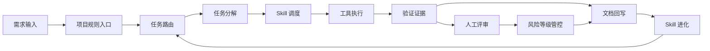

# 企业级全 AI 开发落地闭环

> 本文定义方法论从一句需求到可审计资产的执行闭环。它用于解释图示中的“规则、Skill、MD 文档、MCP 工具、人工评审和风险等级共同约束 AI 生产力”。

## 1. 闭环总览

## 2. 关键约束

| 环节 | 责任 | 正式资产 |
|---|---|---|
| 规则入口 | 规定会话启动、目录边界、执行顺序、验证门禁 | `AGENTS.md`, `rules/AGENTS.md` |
| 任务路由 | 判断任务类型、加载必要 Skill、确认前置检查 | `skills/core/ai-rule-dispatcher/` |
| 任务分解 | 拆批次、定义依赖、给出验收标准 | `skills/core/ai-task-decomposer/` |
| Skill 调度 | 调用领域、治理、技术栈 Skill | `skills/SKILL_MANIFEST.json` |
| 工具执行 | 使用项目已有脚本、MCP、CLI、浏览器和测试工具 | `scripts/`, `tools/` |
| 验证证据 | 形成可复核的测试、截图、日志或报告 | `docs/测试验收报告/` |
| 文档回写 | 把判断、结果、风险和后续动作写回知识库 | `docs/每日调研回写/`, `docs/全项目总控/` |
| Skill 进化 | 将重复问题升级为规则、模板或 Skill 更新 | `skills/core/ai-skill-evolver/` |

## 3. 正式源与适配层

`skills/` 是唯一正式 Skill 源目录。

`.agents/`、`.trae/`、`.qoder/`、`.claude/`、`.codebuddy/` 是部署到不同 AI 工具时的适配层。适配层可以由 `tools/deploy.ps1` 生成或同步，不作为规则和 Skill 的源头。

本地私有素材库只能作为再提炼来源，不参与正式完成统计，也不进入公开发布包。

## 4. 清洗完成标准

一次 Skill 或方法论提炼只有同时满足以下条件，才能从 `callable` 升级为 `verified`：

1. `skills/SKILL_MANIFEST.json` 已登记。
2. 正式目录不含原项目绝对路径、旧总控路径或未解释的专属术语。
3. `AGENTS.md` 和 `rules/AGENTS.md` 引用的路径存在。
4. Skill 具备可执行结构，而不只是口号或目录占位。
5. `py scripts/py/audit_methodology.py --project-root .` 无阻塞失败。

## 5. 当前定位

当前项目已经具备方法论主干和可调用 Skill 库，但仍处在从真实案例资产到可迁移产品资产的清洗阶段。后续重点不是增加更多 Skill 数量，而是提高每个 Skill 的可验证性、可迁移性和跨工具一致性。
