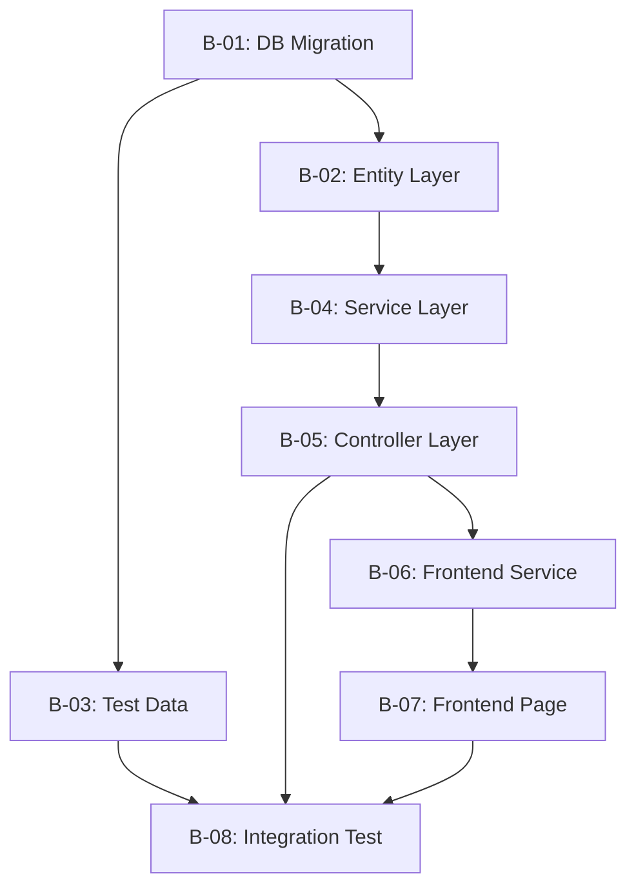

# 自动寻路与任务调度 | Auto-Pathfinding & Task Scheduling

> **源文件**：methodology/02_自动寻路与任务调度.md
> **源版本**：未标注
> **译文日期**：2026-09-14
> **术语依据**：00_导读/02_术语对照表.md
> **翻译口径**：全量对应，不删章节；英文标识符、命令、代码块、门禁代号原样保留。
> **所属**：Enterprise-Grade Full AI Development Methodology（企业级全 AI 开发方法论）
> **前置文档**：00_核心方法论白皮书、01_Skill体系分层架构

---

## 1 自动寻路问题 | The Auto-Pathfinding Problem

当开发者说“新增采购订单审批流”时，AI 必须回答：

1. **哪条项目线？** → 主线开发
2. **适用哪些规则？** → AGENTS.md、project_rules.md、数据库规则
3. **由哪个 Skill 主导？** → 视情况而定：新增 API 则后端优先，改动 UI 则前端优先
4. **先检查什么？** → 已有的 purchase_order 表、已有审批流、当前权限设置
5. **执行顺序？** → DB 迁移 → Entity → Service → Controller → 前端 → 集成测试

**这就是自动寻路问题**：给定一句自然语言请求，判定穿越 Skill 体系的最优执行路径。

---

## 2 路由算法 | The Routing Algorithm

ai-rule-dispatcher 实现确定性路由算法：

```
输入：用户请求（自然语言）

STEP 1：判定任务线
  - 含 "fix"/"bug"？ → mainline
  - 含 "audit"/"check"/"review"？ → audit
  - 含 "competitor"/"research"/"market"？ → research
  - 含 "deploy"/"release"？ → release
  - 含 "architecture"/"boundary"/"domain"？ → governance
  - 默认：mainline

STEP 2：判定任务类型
  - 跨模块（前端 + 后端 + DB）？ → ai-task-decomposer
  - 需要架构决策？ → ai-architect-governor
  - 项目排期？ → ai-chief-planner
  - 命令执行？ → ai-command-executor
  - 其他情况：直接路由到执行层

STEP 3：匹配技术栈
  - 关键词 "vue"/"component"/"page"？ → vue
  - 关键词 "spring"/"java"/"api"？ → java-springboot
  - 关键词 "sql"/"table"/"schema"？ → mysql-best-practices
  - 关键词 "docker"/"container"？ → docker-expert

STEP 4：选定首批文档
  - 始终加载：rules/AGENTS.md
  - 若 project_rules.md 存在：加载它
  - 主导 Skill 的 SKILL.md
  - 相关的 docs/ 分类

STEP 5：定义前置检查
  - DB 变更 → SHOW TABLES、DESCRIBE
  - 代码变更 → 文件是否存在、grep 模式
  - 运行时 → 端口检查、健康端点

输出：路由结果，含主导 Skill、支撑 Skill、文档、检查项
```

---

## 3 任务线优先级 | Task Line Priority System

多条任务线可以同时活跃：

| 任务线 | 优先级 | 典型负责人 | 最大并行 |
|---|---|---|---|
| **Mainline（主线）** | 最高 | 主力开发者 | 活跃开发 |
| **Governance（治理）** | 高 | 架构师 | 架构决策 |
| **Audit（审计）** | 中 | QA / 评审人 | 质量检查 |
| **Research（调研）** | 低 | 任何人 | 调研 |
| **Release（发布）** | 最高（发布窗口期内） | DevOps | 部署 |

### 任务线冲突裁决 | Line Conflict Resolution

当多条任务线的任务争用同一资源时：

1. **Release 线**在发布窗口期内具有绝对优先级
2. **Mainline 阻塞修复**优先于新功能开发
3. **阻塞主线的 Governance 决策**加速处理
4. **Research** 始终可被抢占

---

## 4 依赖感知调度 | Dependency-Aware Scheduling

ai-task-decomposer 产出依赖图：



### 调度规则 | Scheduling Rules

| 规则 | 说明 |
|---|---|
| **Blocker-first（先解阻塞）** | 能解除他人阻塞的任务先执行 |
| **No hot-file collision（无热文件冲突）** | 写同一文件的任务不得并行 |
| **Frontend waits for backend API（前端等后端 API）** | 仅当 API 端点可测后，前端开发才开始 |
| **Tests wait for implementation（测试等实现）** | 集成测试在前端与后端都完成后开始 |

---

## 5 路由示例 | Routing Examples

### 示例 1：修复返回 500 的商品搜索 | Example 1: "Fix the product search that returns 500"

```
分类：
  任务线：mainline（缺陷修复）
  类型：execution（具体文件/API）
  技术栈：取决于项目技术栈

路由：
  主导：java-springboot（若为后端）或 vue（若为前端）
  先检查：服务器日志、/actuator/health、错误堆栈
  文档：rules/AGENTS.md
  前置检查：curl 失败的端点，检查错误日志
```

### 示例 2：新增存货计价报表 | Example 2: "Add inventory valuation report"

```
分类：
  任务线：mainline（功能）
  类型：decomposition（新报表 = DB + 后端 + 前端）
  技术栈：java-springboot + vue

路由：
  主导：ai-task-decomposer（拆分为批次）
  首批文档：rules/AGENTS.md、已有报表示例
  前置检查：inventory 相关表、已有报表模式、权限设置

拆分输出：
  B-01：DB — 新增报表查询表
  B-02：后端 — 报表 service + controller
  B-03：前端 — 报表页 + 筛选器
  B-04：集成测试
```

### 示例 3：审计所有采购流程的收口情况 | Example 3: "Audit all purchase flows for closure"

```
分类：
  任务线：audit
  类型：governance（质量审计）

路由：
  主导：ai-flow-closure-audit
  支撑：ai-domain-boundary-mapper
  首批文档：rules/AGENTS.md、已有业务流程文档
  前置检查：采购模块代码库、API 端点、DB schema

输出：收口审计报告，含按优先级排序的缺口
```

---

## 6 自动寻路失败时 | When Auto-Pathfinding Fails

调度器有一条**升级路径（escalation path）**：

1. **请求含糊** → 向用户提出一个澄清问题（不是多个）
2. **未知领域** → 路由到 ai-chief-planner，做基于调研的排期
3. **检出冲突** → 标记冲突，交由人来决策
4. **无匹配 Skill** → 路由到 ai-skill-evolver 创建 Skill 候选

---

*下一章：[03_13步开发执行引擎.md] — 强制性 13 步开发顺序*

---

## 译注

1. **代码块围栏**：源文件的多行代码块以单个反引号 `` ` `` 作为围栏（`INPUT: ...` 路由算法块、`mermaid` 依赖图块）。译文按 Markdown 规范改为三反引号围栏，**块内文本一字未改**。
2. **块内英文保留范围**：路由算法块与 `mermaid` 依赖图中的标识符、`STEP 1`–`STEP 5` 标签、Skill 名、任务线代号（`mainline`/`audit`/`research`/`release`/`governance`）、文件路径、`SHOW TABLES`、`DESCRIBE` 全部原样保留；仅翻译叙述性文字（如“判定任务线”“选定首批文档”）。示例块中的 `/actuator/health`、`curl`、`rules/AGENTS.md` 同样原样保留。
3. **源版本未标注**：源文件仅有 `Part of` 与 `Prerequisites` 两个元数据行，无版本号或日期，故「源版本」记为「未标注」。
4. **源文件章节编号连续**：第 1–6 节完整对应，无缺号、无重复号、无文件名与内容不一致问题。第 4 节依赖图的批次编号 `B-01`–`B-08` 与第 5 节示例 2 的 `B-01`–`B-04` 属于不同场景下的独立编号，非编号冲突。
